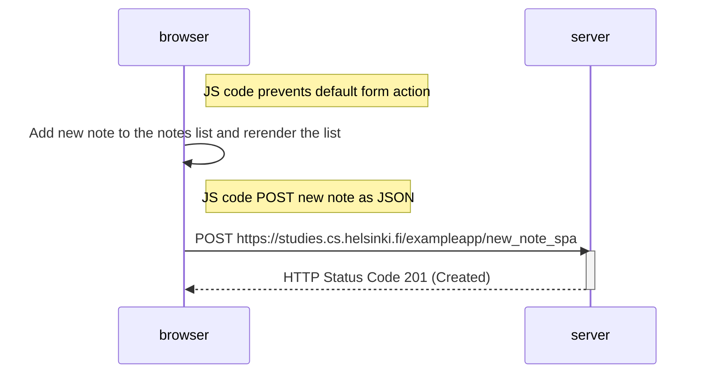

```mermaid
sequenceDiagram
    participant browser
    participant server

    Note right of browser: JS code prevents default form action
    browser->>browser:  Add new note to the notes list and rerender the list

    Note right of browser: JS code POST new note as JSON
    browser->>server: POST https://studies.cs.helsinki.fi/exampleapp/new_note_spa
    activate server
    server-->>browser: HTTP Status Code 201 (Created)
    deactivate server
```